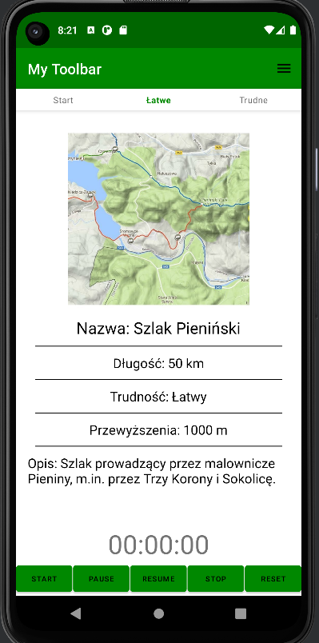

# Lista Szlaków Turystycznych

Aplikacja mobilna napisana w języku Kotlin, która umożliwia użytkownikom przeglądanie i poznawanie różnych szlaków turystycznych. 
Projekt został stworzony jako część zajęć z Aplikacji Mobilnych na Politechnice Poznańskiej.

## Widoki

- **Animacja Logo**: Po uruchomieniu aplikacji użytkownicy zostaną powitani pojawiającym się logo turysty

**Widok startu**: Krótki opis funkcji i celu aplikacji.
    

 **Szlaki według poziomu trudności**: Dwa oddzielne widoki zawierające listy szlaków, podzielone ze względu na poziom trudności, co ułatwia użytkownikom znalezienie odpowiednich tras.

**Szczegóły szlaku**: Po kliknięciu na konkretny szlak użytkownicy mogą zobaczyć szczegółowe informacje na jego temat, takie jak trudność, długość, punkty widokowe itp.
    

## Technologie

- **Język programowania**: Kotlin

## Jak uruchomić

1. Sklonuj repozytorium na swój lokalny komputer.
2. Otwórz projekt w środowisku programistycznym z obsługą języka Kotlin (np. Android Studio).
3. Skompiluj i uruchom projekt na emulatorze lub fizycznym urządzeniu z systemem Android.
